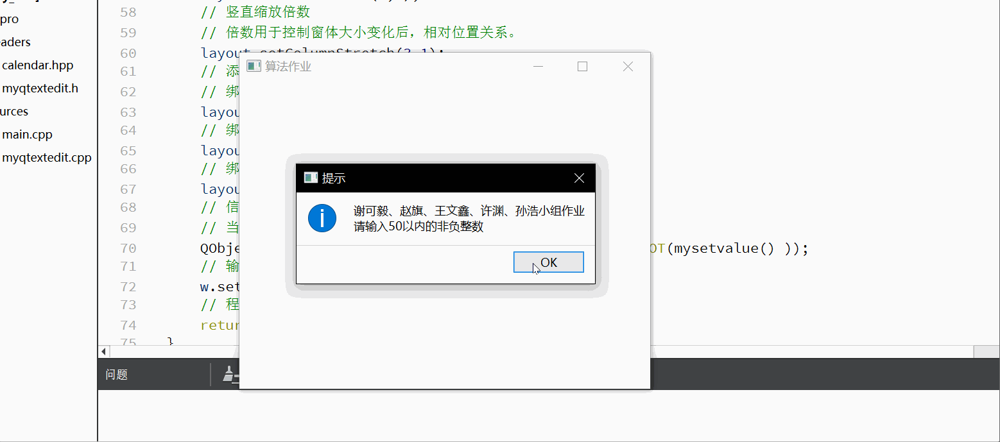
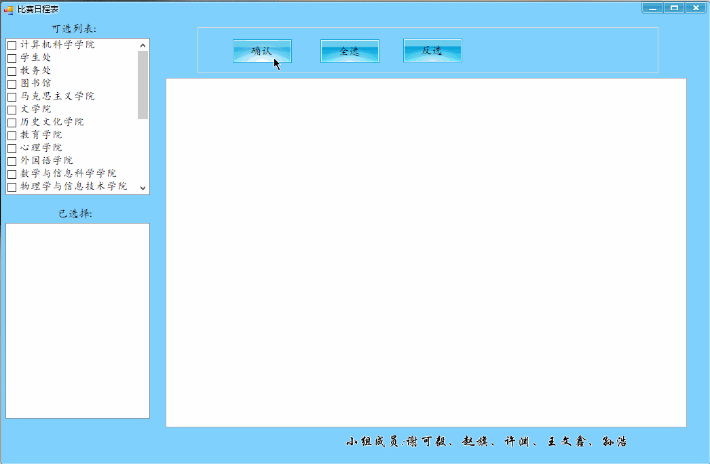

# 算法设计与分析作业

计算机科学与技术(创新实验班)1601班  
大三上学期必修课  
小组成员：谢可毅 孙浩 赵旗 许渊 王文鑫  
## 比赛日程表问题
[比赛日程表](https://github.com/ZhaoQi99/SNNU_Junior_Project/tree/algorithm/sports_meet)
* 2018.09.27
* 2018.09.29 添加算法正确性证明

### 任务

手工设计一个满足以下要求的比赛日程表：
1. 每个选手必须与其他n-1个选手比赛1次
2. 每个选手一天只能比赛1次
3. 循环赛一共进行n-1天

### 算法思想

>算法思想：按分治策略，将所有的选手分为两半，n个选手的比赛日程表就可以通过为n/2个选手设计的比赛日程表来决定。递归地用对选手进行分割，直到只剩下2个选手时，比赛日程表的制定就变得很简单。这时只要让这2个选手进行比赛就可以了

### 正确性证明
1. 在n=2时，就这两个选手比赛，比赛只进行一天，这也是算法的初始情况，算法成立。 
2. 在n=k时，如果k为偶数，则将k个选手分为k/2的两组，这样按问题的要求k个选手共比赛k-1天，k/2个选手如果是偶数则比赛（k/2）-1天，在合并的时候两组k/2个选手循环比赛需要k/2天，则先分组后合并共需要（k/2）-1+（k/2）=k-1天；k/2个选手如果是奇数则比赛k/2天，在合并的时候两组中每个选手都相对应的比赛过了一次，所以两组k/2个选手循环比赛需要（k/2）-1天，则先分组后合并共需要（k/2）+（k/2）-1=k-1天。
3. 如果k为奇数的情况和k为偶数的情况类似。 

### Qtdemo

### C#Demo

